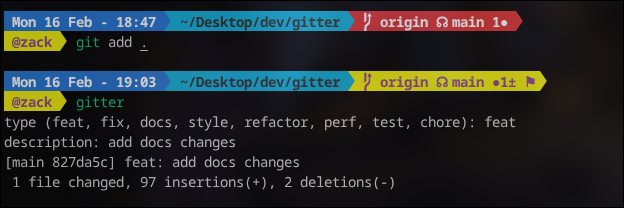

# gitter – Git Commit Message Helper

> Write better Git commits, faster, without thinking too hard.




---

gitter is a simple CLI tool that helps you write consistent, meaningful Git commit messages. It reads your staged changes, prompts you for a type (`feat`, `fix`, etc.), and constructs a properly formatted commit message automatically.

Stop thinking about “what do I write for this commit?” — gitter’s got you.

---

## 🚀 Features

- Interactive prompts for commit type and short description  
- Supports standard commit types: `feat`, `fix`, `chore`, `docs`, `refactor`  
- Checks if there are staged files before committing  
- Works cross-platform (macOS, Linux, Windows)  
- Easy to upgrade with scopes, auto commit, or AI summaries in the future  

---

## 💿 Installation

```bash
npm install -g @kingbit101/gitter

# or

npx i @kingbit101/gitter

```


## 🎯 Usage

# Stage your changes first
git add .


Run gitter:

```bash
gitter
```

Example interaction

```bash
Type (feat, fix, chore, refactor, docs): feat
Short description: add responsive navbar to homepage
```

Git commits automatically:

```bash
feat: add responsive navbar to homepage
```

# Quick commit alias (optional)
```bash
alias gc='git add . && gitter'
```

## 📝 Why gitter exists
Ever stared at your terminal, thinking:
> “Hmm… what should I write for this commit?”

Yeah… we’ve all been there. gitter removes the mental load so you can focus on coding instead of crafting the perfect commit message. It’s your personal Git sidekick. 🦸‍♂️ Just like Us and Bugs!


## 🔖 Scope Support

gitter supports optional commit scopes to make your commits more precise.

When prompted, you can enter a scope (or leave it empty).

### Example with scope

```bash
type (feat, fix, docs, style, refactor, perf, test, chore): feat
description: add scope prompt
Scope (optional): cli

#Results
-----------------------------------
#Example with scope
feat(cli): add scope prompt

#Example without scope
feat: add somestuff
```

## 🎉 Contributing

- Pull requests welcome
- Open issues if you find bugs


## ⚖️ License

MIT License © 2026 Zack Agba 


### 🔮 Coming Soon

~~--**Scope support** (e.g., feat(auth): add login)~~
- **Auto-commit mode** for lightning-fast commits
- **Better prompts** with arrow-key selection
